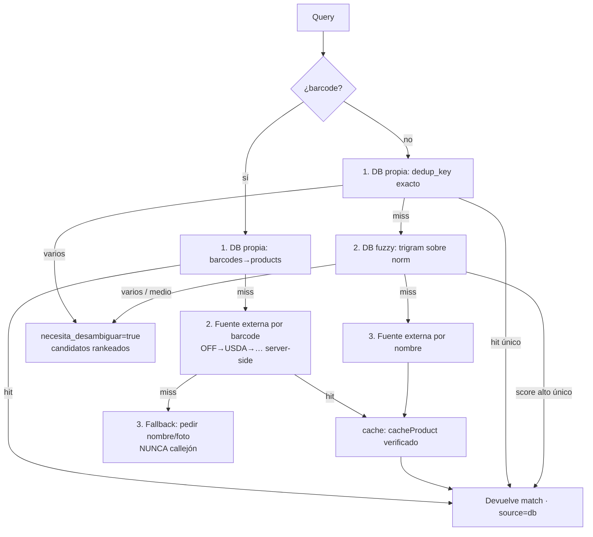

# Base de Datos de Productos Propia — Arquitectura Técnica

**Estado:** PROPUESTA (análisis + arquitectura). NO construido. Build por fases tras aprobación.
**Autor:** Torvalds (CTO). Fuentes externas: pendiente de Ada Research (ver §9).
**Objetivo (Emiliano):** evolucionar *Mi Despensa* a una **base de datos de productos propia** que crece con cada usuario: **busca online → guarda en NUESTRA DB → cache-first**. Cada scan/búsqueda de un usuario enriquece el catálogo para todos.

---

## 1. Contexto y principio rector

Hoy la despensa ya tiene un **catálogo compartido** embrionario (`supabase/despensa.sql`) con semilla *lazy* desde Open Food Facts (OFF). El brief NO es empezar de cero: es **madurar** ese catálogo a un motor cache-first, normalizado y multi-fuente.

**Principio rector:** *cache-first, append-mostly, confianza tipada.* Nunca sobrescribimos un dato de mayor confianza con uno menor; nunca exponemos escritura de `verificado` al cliente; nunca pegamos a una API externa desde el navegador.

**Restricciones heredadas (no negociar):**
- Aditivo e idempotente; lo corre Emiliano (código deploy-safe, tablas ausentes → vacío).
- No tocar `meals` / `profiles` / `targets` / Stripe.
- `verificado` sólo escribible server-side con service_role tras un fetch REAL a la fuente.
- Filas de catálogo inmutables (sin UPDATE/DELETE); el refresco es **append** de una fila nueva.

---

## 2. Análisis de lo que YA existe (inventario preciso)

### 2.1 Esquema actual (`supabase/despensa.sql`)
- **`public.brands`** — `id, name, norm (unique), created_by`. Dedup de marca por `norm`.
- **`public.categories`** — `id, name, norm (unique), parent_id` (jerarquía self-FK ya soportada).
- **`public.products`** — `id, name, norm, brand_id, category_id, default_unit, image_url (1 sola), off_id, origen ∈ {open_food_facts,user,ai,manufacturer}, created_by`. Índice trigram `products_norm_trgm` para fuzzy.
- **`public.product_nutrition`** — N filas por producto; `base_amount/base_unit, calories, protein_g, carbs_g, fat_g, fiber_g, sodium_mg, azucar_g, allergens jsonb, nivel ∈ {verificado,usuario,estimado_ia}, source, source_ref, as_of, created_by`. **La regla de confianza vive aquí.**
- **`public.barcodes`** — `product_id, code (unique), tipo, source`. **Dedup por barcode ya resuelto** (unique global).
- **`public.product_sources`** — `product_id, source_type, external_id, url, fetched_at, raw jsonb`. Traza de procedencia (raw payload guardado).
- **Zona usuario:** `pantries`, `pantry_items` (snapshot: `nombre/marca/categoria/cantidad/unidad/caduca_el/nutricion jsonb/allergens/confianza/imagen`, link OPCIONAL `product_id`), `shopping_lists`, `shopping_list_items`.

### 2.2 Reglas y seguridad ya implementadas
- **RLS catálogo:** SELECT `true` para `authenticated`; INSERT append; **sin UPDATE/DELETE** (filas inmutables).
- **Anti-envenenamiento:** `product_nutrition` INSERT de usuario `with check (nivel in ('usuario','estimado_ia'))` — el usuario NO puede marcar `verificado` (`supabase/despensa.sql:172`).
- **`verificado` server-only:** se escribe únicamente en `app/api/pantry/search/route.js` vía `createAdminClient()` (service_role bypassa RLS) tras `fetchOFF` real; la función definer forjable fue eliminada (`drop function insert_off_nutrition`).
- **Grants defensivos:** `revoke all ... from anon`; `grant select, insert` catálogo a `authenticated`.

### 2.3 Capa de datos y servicio (código)
- **`lib/pantry/off.js`** — `fetchOFF(code)` (timeout 2.5 s AbortController, mapea nutriments incl. kJ→kcal y sodio g→mg, `allergens_tags` → tokens crudos), `normalizeAllergens`, `cacheOFF(admin, userId, code, off)` (inserta products + product_nutrition[verificado] + barcode + product_sources; **idempotente por barcode**: si existe, reusa `product_id`).
- **`app/api/pantry/search/route.js`** — GET `?code=` (local `barcodes`→`products` primero; miss → OFF → cache → atribución) y `?q=` (trigram `ilike` sobre `products.norm`, límite 20). Selección de mejor fila por `NIVEL_RANK`. Cache-first **por barcode ya existe**; falta cache-first por nombre.
- **`lib/pantry/db.js`** — helpers server (`toClientItem`, `readItems` con firma de imágenes en lote, `readItemsParaMatching`, `firmarImagen`). Imágenes de storage firmadas con **cliente de sesión (RLS)**; OFF = URL http passthrough.
- **`lib/pantry/constants.js`** — `CONFIDENCE` (verified/user/ai), `normalizeNutricion` (alias OFF→canónico), `imageOf`, `NUTRICION_FIELDS`.
- **`app/api/pantry/label/route.js`** — visión (`leerEtiqueta`) = `estimado_ia`; sube foto a storage `meal-photos/{uid}/pantry/{uuid}`.

### 2.4 Selección de "mejor dato" (hoy)
`mejorRow()` ordena `product_nutrition` por `NIVEL_RANK = {verificado:3, usuario:2, estimado_ia:1}` y toma el tope. Simple y correcto; le falta desempate por **frescura** (`as_of`) y por **confidence_score**.

---

## 3. Mapa YA / NUEVO (no duplicar)

| Capacidad | Estado | Nota |
|---|---|---|
| Catálogo compartido `products` + `product_nutrition` | ✅ YA | Reusar; extender columnas |
| Dedup por **barcode** | ✅ YA | `barcodes.code unique` + `cacheOFF` reusa |
| Niveles de confianza `verificado/usuario/estimado_ia` | ✅ YA | Reusar tal cual |
| `verificado` server-only (service_role) | ✅ YA | Patrón a mantener para toda fuente nueva |
| Traza de procedencia (`product_sources.raw`) | ✅ YA | Reusar; base de "update strategy" |
| Fuzzy por nombre (trigram) | ✅ YA | `products_norm_trgm`; falta cache-first por nombre |
| Cache lazy OFF por barcode | ✅ YA | Extender a multi-fuente |
| Imagen del producto | ⚠️ PARCIAL | Sólo `products.image_url` (1). Falta **`product_images`** (múltiples) |
| Grasa saturada | ❌ NUEVO | Falta `saturated_fat_g` |
| `subcategory, sku, package_size/type` | ❌ NUEVO | Falta en `products` |
| `source_product_id, source_updated_at` | ❌ NUEVO | Falta (id estable de la fuente + su fecha) |
| `confidence_score 0–1` | ❌ NUEVO | Hoy sólo `nivel` categórico |
| Flag `user_created` vs `verificado` | ⚠️ PARCIAL | Derivable de `origen`; se formaliza con flag |
| **`product_alternatives`** | ❌ NUEVO | **NO existe** (el brief lo listó como existente; corrijo: hay que crearlo) |
| Dedup por **nombre+marca+presentación** | ❌ NUEVO | Hoy sólo dedup por barcode |
| **ProductSearchService** central cache-first | ⚠️ PARCIAL | Lógica dispersa en `search/route.js`; falta servicio único |
| Disambiguation ("¿cuál producto es?") | ❌ NUEVO | Hoy `?code=` devuelve 1; `?q=` lista sin ranking de confianza |
| Rate limit / timeouts / logs de API externa | ⚠️ PARCIAL | Timeout OFF ✅; falta rate limit + log estructurado |
| Update strategy (refrescar sin sobrescribir) | ⚠️ PARCIAL | Inmutabilidad ✅; falta política de refresco/versionado |
| Fuentes ≠ OFF | ❌ NUEVO | Pendiente Ada (§9) |

**Regla de oro anti-duplicación:** todo lo marcado ✅ se **reusa**; lo ⚠️ se **extiende in-place**; sólo lo ❌ es tabla/columna nueva.

---

## 4. Modificaciones de esquema (ADITIVAS, idempotentes)

> Todo con `add column if not exists` / `create table if not exists`. Ninguna columna existente cambia de tipo ni se borra. Lo corre Emiliano; el código es deploy-safe si aún no corre.

### 4.1 `products` — columnas nuevas
```sql
alter table public.products add column if not exists subcategory        text;
alter table public.products add column if not exists sku                text;      -- código interno/fabricante (≠ barcode)
alter table public.products add column if not exists package_size       numeric;   -- p.ej. 500
alter table public.products add column if not exists package_unit       text;      -- 'g','ml','pza'
alter table public.products add column if not exists package_type       text;      -- 'lata','bolsa','botella','caja'
alter table public.products add column if not exists source_product_id  text;      -- id estable del producto EN la fuente
alter table public.products add column if not exists source_updated_at  timestamptz; -- cuándo la fuente actualizó ese producto
alter table public.products add column if not exists confidence_score   numeric check (confidence_score is null or (confidence_score >= 0 and confidence_score <= 1));
alter table public.products add column if not exists is_user_created    boolean not null default false; -- flag explícito vs catálogo verificado
alter table public.products add column if not exists updated_at         timestamptz not null default now();
alter table public.products add column if not exists presentacion       text;      -- presentación CANÓNica "value|unit" (Karpathy normalizePresentacion)
alter table public.products add column if not exists dedup_key          text;      -- clave débil canónica (ver §6, fórmula de Karpathy)
create unique index if not exists products_dedup_key_uq on public.products (dedup_key) where dedup_key is not null;
```
`origen` ya distingue la fuente; `is_user_created` es el flag booleano pedido para UI/filtrado rápido (redundante-por-diseño, barato). `presentacion` guarda la forma canónica (`normalizePresentacion`, p.ej. `120|g`, `1000|ml`) que alimenta tanto `dedup_key` como la señal de presentación del matching (§5.3).

### 4.2 `product_nutrition` — grasa saturada + frescura por fuente (align Karpathy §5)
```sql
alter table public.product_nutrition add column if not exists saturated_fat_g   numeric;
alter table public.product_nutrition add column if not exists source_updated_at timestamptz; -- frescura de ESTA fuente (drive de pickBestSource)
```
- `saturated_fat_g` se cablea en `fetchOFF` (`nutriments['saturated-fat_100g']`) y en `leerEtiqueta`.
- **UNA fila por fuente** (regla dura de Karpathy): cada `product_nutrition` es un dato de una sola fuente (`source`, `source_ref` = `source_product_id`, `source_updated_at`, `nivel`, `allergens`). **Nunca se fusionan campos de fuentes distintas en una fila silenciosa** — si la fuente elegida no trae fibra, fibra = `null` (no se rellena desde otra fuente salvo confirmación explícita del usuario).
- La selección la hace `pickBestSource()` (cerebro, §7): `verificado > usuario(introducido) > estimado_ia`; a igualdad, mayor `source_updated_at`. `source_ref` existente **es** el `source_product_id` a nivel nutrición (no se agrega columna nueva ahí).
- *Nota de nomenclatura:* la columna DB `nivel ∈ {verificado,usuario,estimado_ia}` no cambia; el cerebro usa el alias `verificado/introducido/estimado` (ya mapeado en `lib/pantry/constants.js:PROCEDENCIA_TO_CONFIDENCE`). Se mantiene la constraint existente.

### 4.3 `product_images` — múltiples imágenes (NUEVO)
```sql
create table if not exists public.product_images (
  id          uuid primary key default gen_random_uuid(),
  product_id  uuid not null references public.products (id) on delete cascade,
  image_url   text not null,
  source      text not null default 'user'
              check (source in ('open_food_facts','user','ai','manufacturer','retailer')),
  image_type  text not null default 'front'
              check (image_type in ('front','nutrition','ingredients','other')),
  is_primary  boolean not null default false,
  as_of       date,
  created_by  uuid references auth.users (id) on delete set null,
  created_at  timestamptz not null default now()
);
create index if not exists product_images_product on public.product_images (product_id);
-- RLS: SELECT true a authenticated; INSERT append (misma política que el resto del catálogo).
```
`products.image_url` se conserva como **imagen primaria denormalizada** (compatibilidad); `product_images` es la fuente de verdad multi-imagen.

### 4.4 `product_alternatives` — sustitutos/equivalentes (NUEVO)
```sql
create table if not exists public.product_alternatives (
  id             uuid primary key default gen_random_uuid(),
  product_id     uuid not null references public.products (id) on delete cascade,
  alternative_id uuid not null references public.products (id) on delete cascade,
  relation       text not null default 'similar'
                 check (relation in ('similar','healthier','cheaper','same_brand','presentation')),
  score          numeric check (score is null or (score >= 0 and score <= 1)),
  created_by     uuid references auth.users (id) on delete set null,
  created_at     timestamptz not null default now(),
  check (product_id <> alternative_id),
  unique (product_id, alternative_id, relation)
);
create index if not exists product_alternatives_product on public.product_alternatives (product_id);
```
V1 puede quedar **vacío** (lo puebla el coach/servicio en fase posterior); se crea la tabla ahora para no re-migrar.

### 4.5 Log de fetches externos — observabilidad + rate limit (NUEVO)
```sql
create table if not exists public.external_fetch_log (
  id          uuid primary key default gen_random_uuid(),
  user_id     uuid references auth.users (id) on delete set null,
  source      text not null,           -- 'open_food_facts','usda',...
  query_type  text not null,           -- 'barcode','name'
  query       text,
  http_status int,
  hit         boolean,                  -- ¿la fuente devolvió producto?
  latency_ms  int,
  created_at  timestamptz not null default now()
);
create index if not exists external_fetch_log_rate on public.external_fetch_log (user_id, created_at);
create index if not exists external_fetch_log_source on public.external_fetch_log (source, created_at);
-- Sólo server-side (service_role) escribe/lee; sin grants a authenticated. RLS deny-all por defecto.
```

### 4.6 Índices fuzzy (retrieval top-K del cerebro §2)
```sql
-- products.norm ya tiene GIN trigram (products_norm_trgm en despensa.sql). Falta brands.norm:
create index if not exists brands_norm_trgm on public.brands using gin (norm gin_trgm_ops);
```
`pg_trgm` ya está habilitado (`create extension` en `supabase/despensa.sql`). Estos índices sostienen la **recuperación de candidatos top-K** por `similarity()` que consume `simNombre` del cerebro.

---

## 5. `ProductSearchService` (central, cache-first)

Servicio server-only (`lib/pantry/product-search.js`, NUEVO) que **centraliza** la lógica hoy dispersa en `app/api/pantry/search/route.js`. Contrato único para barcode, nombre y foto.

```
buscar({ barcode?, nombre?, marca?, presentacion?, userId }) → {
  match:      Product | null,      // 1 ganador con confidence alto
  candidatos: Product[],           // para disambiguation si ambiguo
  necesita_desambiguar: boolean,
  source: 'db' | 'cache' | 'open_food_facts' | 'usda' | ... | null,
  atribucion?: string
}
```

### 5.1 Cascada cache-first (orden estricto)


- **Paso 1 (DB propia)** es siempre primero → *cache-first*. Barcode: `barcodes.code` (exacto). Nombre: `dedup_key` exacto, luego trigram.
- **Paso 2 (externa)** sólo si la DB no resuelve; server-side, con rate limit + timeout + log (§8). Al traer, **cachea** (§7) para que la próxima vez sea paso 1.
- **Paso 3 (fallback gracioso)** nunca deja al usuario sin salida: ofrece capturar por foto de etiqueta (`estimado_ia`) o manual.

### 5.2 Prioridad de estrategias de búsqueda
1. **Barcode** (máxima prioridad — identidad exacta).
2. **Nombre + marca + presentación** normalizados (`dedup_key`) — match exacto.
3. **Nombre + presentación** (sin marca) — cuando falta marca.
4. **Fuzzy** (trigram `similarity()` sobre `products.norm`) — último recurso en DB, con umbral (p.ej. `similarity ≥ 0.35`).

### 5.3 `confidence_score` en el matching (fórmula de Karpathy — autoridad del cerebro)
El score de matching lo define el **cerebro** (`plan/producto-db-cerebro.md` §1), determinista y calibrable. Mi capa **no lo redefine**; sólo entrega candidatos + I/O:
```
confidence(query, cand):
  if barcodeExacto: return 1.0
  s = 0.55 · simNombre(query.nombre, cand.nombre)   // Jaccard tokens + Levenshtein/token (§2)
  if marcaMatch(norm):        s += 0.25
  if presentacionMatch:       s += 0.15             // presentacion canónica
  if categoriaMatch:          s += 0.05
  return clamp(s, 0, 1)
```
**Umbrales (Karpathy):** `≥ 0.85` (o barcode 1.0) → **auto-aceptar**; `0.45–0.85` → **disambiguation** (top-N + "ninguno"); `< 0.45` o sin candidato → **no encontrado** (etiqueta/manual). Regla dura: nunca auto-aceptar bajo umbral (no atar nutrición equivocada).

`products.confidence_score` (columna §4.1) persiste el score **de la fila/fuente** (calidad del dato); el score de *matching* se calcula por consulta con la fórmula de arriba. Son distintos y complementarios.

**División I/O ↔ cerebro:** las funciones puras (`normalizeQuery`, `simNombre`, `confidence`, `rankCandidates`, `decideMatch`, `normalizePresentacion`, `dedupKey`, `pickBestSource`) viven en `lib/pantry` (cerebro de Karpathy) e **importan de mi capa de datos** (`lib/pantry/db.js` / `lib/pantry/product-search.js`). Yo cablo: SQL (retrieval top-K por trigram), fetch OFF/externo (`lib/pantry/off.js`), storage y el shape; el cerebro recibe candidatos y **decide**. Nada de invención: dato faltante = `null`.

### 5.4 Disambiguation ("¿cuál producto es?")
Cuando `necesita_desambiguar`, el servicio devuelve `candidatos[]` (máx. ~5) ordenados por score, cada uno con `{id, nombre, marca, package_size+unit+type, image_url, confianza}` para que el front pregunte. La selección del usuario:
- fija el `product_id` en el `pantry_item`,
- registra un refuerzo suave (subir `confidence_score` del elegido / poblar `product_alternatives` entre las presentaciones) — opcional fase 2.

---

## 6. Deduplicación

**Dos llaves, en orden:**
1. **Barcode** (ya): `barcodes.code unique` global. Es la identidad fuerte; si hay barcode, gana.
2. **Nombre + marca + presentación** (NUEVO): columna `products.dedup_key` con índice único parcial. **Fórmula canónica de Karpathy** (`dedupKey()` puro):
   ```
   dedup_key = norm(marca) | tokensOrdenados(norm(nombre_sin_marca_ni_presentacion)) | presentacionCanonica
   ```
   - `tokensOrdenados`: quita marca y presentación del nombre y **ordena** los tokens → orden-independiente ("Yogurt Griego Lala 120g" ≡ "Lala Yogurt Griego 120 g" → `lala|griego yogurt|120|g`).
   - `presentacionCanonica` = `normalizePresentacion(text)` → `value|unit` normalizado ("120 g"→`120|g`, "0.12kg"→`120|g`, "1 L"→`1000|ml`). Se persiste también en `products.presentacion` (§4.1).
   - `norm()` reusa `lib/pantry/text.js` (sin acentos, minúsculas, espacios colapsados).
   - Lo calcula el **cerebro (`dedupKey`) y lo persiste el ProductSearchService al insertar** (no un trigger, para evolucionar la fórmula sin migración). Insert con `on conflict (dedup_key) do nothing` + re-select → idempotente. Si difiere sólo la fuente, se agrega fila de `product_nutrition`/`product_sources`, **no** un producto nuevo.

**Merge de duplicados legado (fase de mantenimiento):** un job server-side que agrupa por `dedup_key`, elige el canónico (mayor `confidence_score`/`verificado`), repunta `barcodes`/`product_nutrition`/`pantry_items.product_id` y marca los demás como alias. NO en V1; documentado.

---

## 7. Estrategia de actualización (refrescar sin sobrescribir)

**Invariante:** las filas de confianza son **inmutables**; refrescar = **append** de una fila nueva, nunca UPDATE de procedencia/fecha.

- **Nutrición:** al refetch de una fuente, `insert` de un nuevo `product_nutrition` con su `nivel/source/source_ref/source_updated_at`. La selección del vigente la hace **`pickBestSource()` del cerebro** (reemplaza/formaliza `mejorRow`): determinista, `verificado > usuario(introducido) > estimado_ia`; a igualdad, mayor `source_updated_at`. **Nunca fusiona campos de fuentes distintas.** La historia queda para auditoría/rollback.
- **Núcleo del producto (`products`):** campos identitarios (name/brand/package) NO se pisan a ciegas. Se permite **UPDATE controlado server-side** de `image_url` primaria, `source_updated_at`, `confidence_score` y `updated_at` cuando la MISMA fuente (o una de mayor confianza) trae dato más nuevo; el histórico de imágenes vive en `product_images` (append). *(Requiere una policy UPDATE server-only por service_role; el UPDATE de catálogo por `authenticated` sigue prohibido.)*
- **Frescura / staleness:** `source_updated_at` + `as_of` permiten un TTL (p.ej. re-verificar OFF si `as_of` > 180 días) — el refetch es lazy (en la próxima búsqueda), nunca un cron pesado en V1.
- **Versionado:** implícito por append + `as_of`. Si hace falta versión explícita, se añade `product_nutrition.version int` en fase posterior (no ahora).
- **Procedencia intacta:** un dato `usuario`/`estimado_ia` **jamás** se re-etiqueta como `verificado`; sólo un fetch REAL server-side crea la fila `verificado`.

---

## 8. Seguridad (APIs externas)

| Control | Diseño |
|---|---|
| **Server-side only** | Toda fuente externa se consulta desde el servidor (route handler / service). El navegador NUNCA ve API keys ni pega a terceros. Patrón ya vigente (`fetchOFF` server). |
| **API keys** | En variables de entorno server (`*_API_KEY`), nunca `NEXT_PUBLIC_*`. Escritura `verificado` sólo con `SUPABASE_SERVICE_ROLE_KEY` (ya en Vercel). |
| **Timeouts** | `AbortController` por fuente (OFF ya 2.5 s). Presupuesto total de la búsqueda acotado (p.ej. ≤ 4 s) para no colgar la request. |
| **Rate limit** | Por usuario y global, vía `external_fetch_log` (cuenta en ventana) + cap en `app_config` (patrón `despensa_reco`). Excedido → degrada a "sólo DB" + fallback, sin error 500. |
| **Cache** | Cache-first (§5) minimiza llamadas; todo hit externo se cachea. TTL por `as_of`. |
| **Validación** | Payloads externos pasan por normalizadores (`normalizeAllergens`, `normalizeNutricion`, coerción numérica, límites de longitud/rango). Nada crudo entra a la DB sin sanitizar; `raw` se guarda en `product_sources` para auditoría, no se confía. |
| **Logs** | `external_fetch_log` (fuente, tipo, status, hit, latencia). Sin PII; `query` truncado. Para detectar caídas de fuente y afinar rate limit. |
| **Licencia** | OFF = ODbL (atribución obligatoria + share-alike al redistribuir). Cada fuente nueva se evalúa antes de cachear/redistribuir (§9, review legal con Ada). Atribución por fuente en `product_sources`. |
| **Anti-abuso de escritura** | Se mantiene: `authenticated` sólo INSERT `usuario/estimado_ia`; `verificado` server-only; filas inmutables salvo UPDATE server-only controlado (§7). |

---

## 9. Fuentes externas — PENDIENTE de Ada Research (d4bsvfz7)

Hoy única fuente = **Open Food Facts** (cobertura MX floja). Para el motor multi-fuente necesito de Ada una **tabla comparativa**. Preguntas enviadas (relay vía Director; `SendMessage` peer no está habilitado en este entorno):

1. **Cobertura MX por barcode:** OFF, USDA FoodData Central, Nutritionix, Edamam, FatSecret, Chomp/FoodRepo, Barcode Lookup, Datakick, GS1 México, APIs de retailers MX (Walmart/Soriana/Chedraui). ¿Cuáles tienen productos **mexicanos** reales con nutrición + alérgenos?
2. **Por fuente viable:** (a) **licencia** (¿podemos cachear/redistribuir? OFF=ODbL share-alike), (b) rate limit / precio (free vs pago), (c) requiere API key, (d) completitud (kcal/macros/fibra/azúcar/sodio/**grasa saturada**) + **alérgenos estructurados**, (e) trae **imágenes**.
3. **Orden de prioridad recomendado para MX** (barcode primero) y cuáles descartar por licencia/costo.
4. **Fuente para desambiguar** presentaciones (mismo nombre+marca, distinta presentación).

El `ProductSearchService` (§5.1 paso 2) queda parametrizado por una **lista ordenada de adapters** (`OFF → …`); añadir una fuente = un adapter nuevo que devuelve el shape canónico + su `nivel/atribución`. Ada define el orden; yo el adapter.

---

## 10. Plan de build por fases (tras aprobación)

- **Fase 0 — Esquema (§4):** un `supabase/producto-db.sql` aditivo idempotente (columnas de `products` incl. `presentacion`/`dedup_key`, `product_nutrition.saturated_fat_g`+`source_updated_at`, `product_images`, `product_alternatives`, `external_fetch_log`, índice trgm `brands.norm`, RLS/grants). Lo corre Emiliano. Código deploy-safe.
- **Fase 1 — ProductSearchService + cache-first por nombre:** extraer la lógica de `app/api/pantry/search/route.js` a `lib/pantry/product-search.js` (I/O); cablear las funciones puras del cerebro (`dedupKey`/`normalizePresentacion`/`simNombre`/`confidence`/`decideMatch`/`pickBestSource`); `dedup_key`; cachear búsquedas por nombre; disambiguation en `?q=`.
- **Fase 2 — Multi-fuente:** adapters según Ada (§9); rate limit + `external_fetch_log`; grasa saturada; `product_images` multi-imagen.
- **Fase 3 — Update strategy + alternativas:** refetch lazy por TTL; poblar `product_alternatives` (coach); merge de duplicados legado.

Cada fase: aditiva, deploy-safe, QA por rebanada, sin tocar Stripe, sin sobrescribir procedencia.

---

## 11. Decisiones abiertas (para el Director/Emiliano)
1. **Contribución cruzada:** ¿un producto creado por el usuario A (`is_user_created`) es visible para B? Hoy el catálogo es global (SELECT true). Propongo: **sí**, pero con `confidence_score` bajo hasta que una fuente lo verifique (evita ruido sin fragmentar el catálogo).
2. **UPDATE server-only de `products`** (§7): requiere una policy nueva por service_role. ¿OK abrir ese seam controlado o preferimos append-only también en el núcleo (nueva fila producto + `dedup_key` que reapunta)? Recomiendo UPDATE server-only acotado (más simple, menos huérfanos).
3. **Licencia:** confirmar con Ada qué fuentes permiten cachear en nuestra DB antes de la Fase 2 (bloqueante legal).
4. **`product_alternatives` en V1:** crear tabla vacía ahora (recomendado) vs. diferir. Recomiendo crear para no re-migrar.

---

# 12. FASE 2 — Delta "nivel OFF/Yuka/MyRealFood", enfoque MÉXICO (PROPUESTA)

> Estado: **propuesta, NO implementar** (espera GO). Todo ADITIVO sobre lo vivo. Fuentes legalmente
> almacenables asumidas **OFF + USDA** (Ada confirma); campos marcados **[Ada]** dependen de su hallazgo.
> Reusa lo ya construido (§1–§11): `ProductSearchService`, procedencia por fuente, `confidence_score`,
> `dedup_key`, `product_images`, `external_fetch_log`, `products/product_nutrition/product_alternatives`,
> búsqueda por nombre vía OFF Search-a-licious. **No se rehace nada de eso.**

## 12.1 Tablas/columnas — YA CUBIERTO vs NUEVO

| Elemento del brief | Estado | Detalle |
|---|---|---|
| `brands.id/name` | ✅ YA | `brands(id,name,norm,created_by)` |
| `brands.country` | ❌ NUEVO | `alter table brands add column country text` (código país ISO-2) |
| `categories.id/name/parent_category` | ✅ YA | `categories(id,name,norm,parent_id)` — **`parent_id` ES el `parent_category`** (self-FK, ya soporta jerarquía). No hace falta nada |
| `ingredients(product_id/ingredient/position)` | ❌ NUEVO | tabla `product_ingredients(product_id, ingredient text, position int, source text)` |
| `additives(product_id/additive_code/name/source)` | ❌ NUEVO | tabla `product_additives(product_id, additive_code, name, source text)`. `nivel_riesgo` **[Ada]** — SOLO si confirma fuente libre para clasificación de riesgo; si no, **se omite** (no inventar riesgo) |
| `products.nutri_score` | ❌ NUEVO | `char(1)` check A–E (dato de OFF) |
| `products.nova_group` | ❌ NUEVO | `smallint` check 1–4 (dato de OFF) |
| `products.data_quality` (enum) | ❌ NUEVO | `text check in ('verified','community','estimated','incomplete')` — rollup categórico (§12.4) |
| `products.data_quality_score` | ❌ NUEVO | `numeric 0..1` de **completitud** (§12.4). **Distinto** de `confidence_score` (que ya existe y mide confianza del *match/fuente*); documentar los dos ejes |
| `products.country` | ❌ NUEVO | **el brief lo asume existente, pero NO existe** → se agrega. ISO-2, inferible del prefijo de barcode (§12.6) |
| `products.confidence_score / dedup_key / is_user_created / presentacion` | ✅ YA | reusar tal cual (Fase 0) |
| `products.subcategory / sku / package_*` | ✅ YA | reusar (Fase 0) |
| `product_nutrition.saturated_fat_g` | ✅ YA | Fase 0 |
| `product_nutrition.trans_fat_g` | ❌ NUEVO | grasas trans (necesario para sello NOM y salud) |
| `product_nutrition.serving_size + serving_unit` | ❌ NUEVO | porción declarada en la etiqueta (además del canónico por-100g). Hoy `base_unit='porcion'` sirve para 1 fila, pero se quiere **por-100g Y por-porción**; columnas explícitas evitan filas duplicadas |
| `product_nutrition.source/source_ref/source_updated_at/nivel/allergens` | ✅ YA | procedencia por fuente (Fase 0/§5) |
| `product_images` (multi-imagen) | ✅ YA | Fase 0 |
| `product_alternatives` | ✅ YA | creada (Fase 0), feature en Fase 7 |

**Regla:** ✅ se reusa; ❌ es columna/tabla nueva **aditiva idempotente**. Nada existente cambia de tipo.

## 12.2 Normalización multi-fuente (interfaz genérica)

Hoy `lib/pantry/off.js` (`mapOFF`, `mapSaLHit`) ya convierte los nutrimentos de OFF a nuestras claves. Se
**formaliza** en una capa única `lib/pantry/nutrition-normalize.js` (NUEVO) con:

- **Esquema canónico** por-100g: `{ calories_per_100g, protein_g, carbs_g, fat_g, saturated_fat_g, trans_fat_g, fiber_g, sugars_g, sodium_mg, nutri_score?, nova_group? }`. Nada de invención: ausente = `null`.
- **`toCanonical(raw, sourceKind)`**: mapea alias de cada fuente → canónico. Cubre hoy `energy-kcal_100g | calories | kcal → calories_per_100g` y equivalentes de proteína/grasa/carbs/fibra/azúcar/sodio. OFF ya resuelto; USDA se suma como otro `case`.
- **Interfaz de adapter** (para sumar fuentes sin tocar el servicio):
  ```
  SourceAdapter = {
    key: 'open_food_facts' | 'usda' | ...,
    nivel: 'verificado',
    fetchByBarcode(code): Promise<RawProduct|null>,
    searchByName(q, {limit}): Promise<RawProduct[]>,
    toCanonical(raw): CanonicalProduct   // usa nutrition-normalize
  }
  ```
  El `ProductSearchService` (§5) itera una **lista ordenada de adapters** (Ada define el orden); OFF es el primer adapter (ya vivo). Añadir USDA = un archivo `lib/pantry/sources/usda.js` que implementa la interfaz.
- **Por-porción**: `perServing(canon100, serving_size, serving_unit)` (pura) escala del canónico por-100g. Se computa al vuelo para la UI; `serving_size/serving_unit` se persisten (§12.1) para reproducir la etiqueta.

## 12.3 Sellos NOM-051 (México)

Función **PURA** `lib/pantry/nom051.js` (NUEVO): `sellosNOM051(nutricionPor100, tipo)` → `{ calorias, azucares, grasas_sat, grasas_trans, sodio }` (booleans) según **umbrales oficiales NOM-051 [Ada entrega los umbrales]**. Sólo **reproduce la etiqueta** (no es asesoría médica); determinista y testeable.

- **Decisión: computar-al-vuelo** (source of truth), no almacenar el veredicto — los umbrales pueden ajustarse y no queremos sellos obsoletos; el cómputo es O(1). *Opcional* cachear un `sellos jsonb` en `product_nutrition` **sólo** para filtrar/ordenar en SQL a escala (se recomputa al escribir; nunca es la verdad). Requiere `trans_fat_g` (§12.1).
- **Bloqueante:** sin umbrales de Ada no se activa el cómputo (no inventamos umbrales).

## 12.4 `data_quality_score` + enum de calidad

Función pura `lib/pantry/quality.js` (NUEVO): `calidadDe(product)` → `{ score, level }`.

```
score =  0.20·tieneBarcode
       + 0.15·tieneImagen
       + 0.25·nutricionCompleta(kcal+prot+carb+gras)
       + 0.10·tieneMarca
       + 0.10·tieneIngredientes
       + 0.20·confianzaFuente(verificado 1 / usuario 0.5 / estimado 0.25)
level = verified   si score≥0.8 y nivel='verificado'
      | community  si is_user_created y score≥0.5
      | estimated  si nivel='estimado_ia' o score∈[0.3,0.5)
      | incomplete si faltan macros esenciales o score<0.3
```

- **Se persiste** `data_quality_score` + `data_quality` (denormalizados para **ordenar** resultados de búsqueda por calidad), **recomputados por la función pura en cada escritura** (nunca a mano). `confidence_score` sigue midiendo el *match/fuente*; `data_quality_score` mide *completitud del dato*. Dos ejes complementarios.
- **Regla de oro:** un `estimated`/`incomplete` **nunca** se presenta como exacto — la UI ya usa el badge de `confianza`; se añade el nivel de calidad al mismo.

## 12.5 Búsqueda tolerante a errores (pg_trgm)

Ya existen `products_norm_trgm` y `brands_norm_trgm` (GIN). Se **integra `similarity()`** en la rama de nombre del `ProductSearchService` (hoy usa `ilike`):

- `localFuzzy` pasa a `... where similarity(norm, :q) > 0.3 order by similarity desc limit K` (recupera top-K real por trigramas; el cerebro `simNombre`/`rankCandidates` re-rankea). Fallback `ilike` si `pg_trgm` faltara.
- **Ejes de búsqueda** (todos vía `normalizeQuery` + `rankCandidates`): barcode, nombre, marca (`brands.norm` trgm), nombre+marca, categoría (`categories.norm`). El cerebro ya pondera marca/presentación/categoría (§5.3).

## 12.6 Multi-país (MX/US/ES/AR/CO/CL) sin rehacer

- `products.country` + `brands.country` (§12.1). **Inferencia por prefijo GS1 del barcode** al cachear (`lib/pantry/country.js`, NUEVO): `750→MX, 0–13→US/CA, 84→ES, 779→AR, 770→CO, 780→CL, 8400–8449→ES…`. Determinista, sin fuente externa.
- **Priorización:** el `ProductSearchService` recibe `userCountry` (default `MX`) y el ranking **bonifica `country=userCountry`** (empate a favor de MX cuando el usuario está en MX). Cambiar de país = cambiar el parámetro; **no** se re-migra. Preparado para los 6 países desde el día 1.

## 12.7 Imágenes: URL externa vs storage propio (licencia)

- **Imágenes de OFF/fuente → se REFERENCIAN por URL externa** (`images.openfoodfacts.org/...`) en `product_images.image_url` con `source='open_food_facts'`. **Justificación:** ODbL permite uso con **atribución** ("Datos de Open Food Facts") y su CDN es hotlink-friendly; **no copiamos** el binario → cero costo de storage y menos fricción share-alike (enlazamos, no redistribuimos el archivo). 
- **Imágenes subidas por el USUARIO → storage propio** (bucket `meal-photos`, path `{uid}/pantry/...`, ya implementado) con `source='user'`. Son nuestras, RLS por usuario.
- `product_images.source` ya distingue ambos → **decisión ya soportada por el esquema**; sólo se fija la política. (Revisión legal de USDA/otras fuentes antes de enlazarlas — [Ada].)

## 12.8 Faseo técnico (mapa a SQL + módulos) → ver `plan/producto-db-fases.md` §CTO

Resumen: **Fase 3 (barcode MVP) = ✅ HECHA**; **Fase 4** = migración de columnas (country/nutri_score/nova/data_quality*/trans_fat/serving) + `nutrition-normalize` + `country` + `similarity()` + `quality`; **Fase 5** = `product_ingredients`(+`product_additives` [Ada]) + `nom051` [Ada umbrales] + OCR (ya vivo); **Fase 6** = integración despensa/coach (reuso); **Fase 7** = `product_alternatives` feature (ya creada la tabla). Cada fase: migración aditiva idempotente + módulos puros testeables, deployable y verificable por separado (detalle en fases.md).
